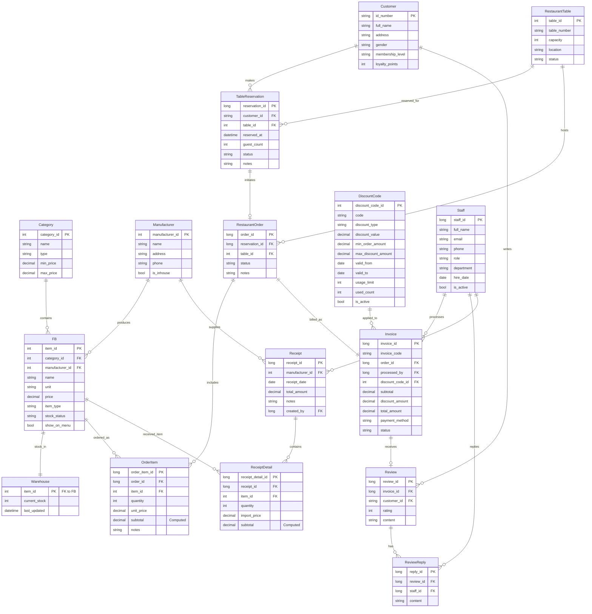

# Project 1 Day

This project consists of a Vue.js frontend and a .NET Core Web API backend.

## Project Structure

- `frontend/`: Vue.js application (Vite)
- `backend/`: .NET Core Web API

## Getting Started

### Backend
1. `cd backend`
2. `dotnet run`

### Frontend
1. `cd frontend`
2. `npm install` (already done)
3. `npm run dev`

## Configuration
The backend is configured to use Entity Framework Core with SQL Server.
The frontend is a default Vite + Vue starter.

## Database Schema

Below is the Entity-Relationship diagram for the Restaurant Management System:

